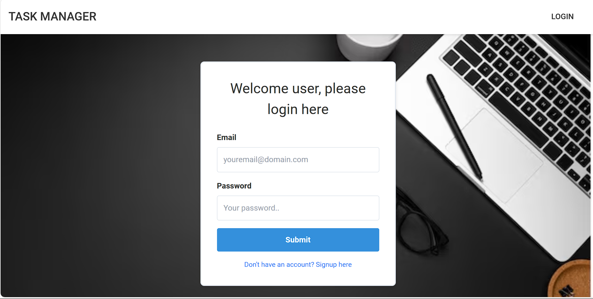
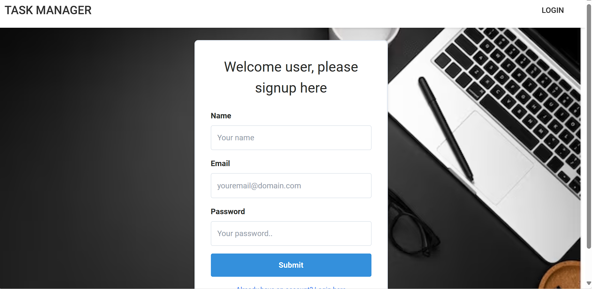
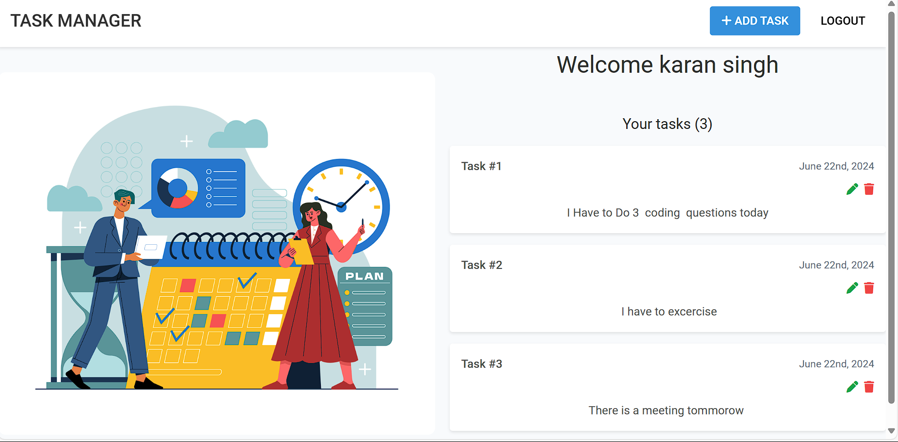
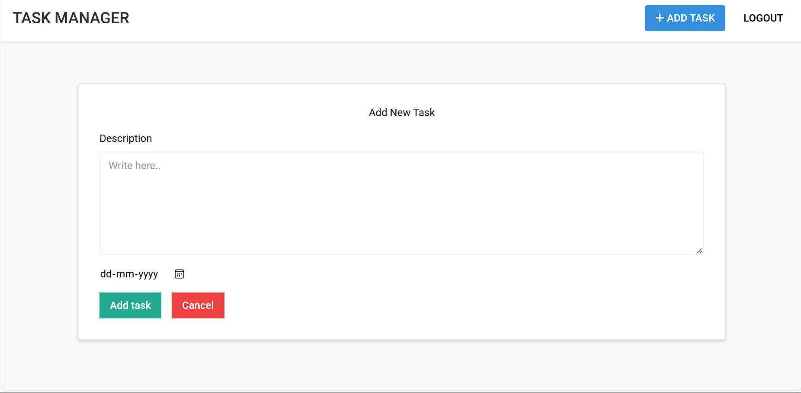

MERN Task Manager
A MERN application for basic tasks management.

Table of Contents
Features
Tools and Technologies
Dependencies
Dev-dependencies
Prerequisites
Installation and setup
Backend API
Frontend pages
npm scripts
Useful Links
Contact
Features
User-side features
Signup
Login
Logout
Add tasks
View tasks
Update tasks
Delete tasks
Developer-side features
Toasts for success and error messages
Form validations in frontend and backend
Fully Responsive Navbar
Token based Authentication
Use of 404 page for wrong urls
Relevant redirects
Global user state using Redux
Custom Loaders
Use of layout component for pages
Use of theme colors
No external CSS files needed (made using Tailwind CSS)
Usage of Tooltips
Dynamic document titles
Redirect to previous page after login
Use of various React hooks
Custom hook also used (useFetch)
Routes protection
Middleware for verifying the user in backend
Use of different HTTP status codes for sending responses
Standard practices followed

Tools and Technologies
HTML
CSS
Javascript
Node.js
Express.js
React
Redux
Mongodb
Dependencies
Following are the major dependencies of the project:

axios
react
react-dom
react-redux
react-router-dom
react-toastify
redux
redux-thunk
bcrypt
cors
dotenv
express
jsonwebtoken
mongoose
Dev-dependencies
Following are the major dev-dependencies of the project:

nodemon
concurrently
Prerequisites
Node.js must be installed on the system.
You should have a MongoDB database.
You should have a code editor (preferred: VS Code)
Installation and Setup
Install all the dependencies

sh
Copy code
npm run install-all
Create a file named ".env" inside the backend folder. Add data from .env.example file and substitute your credentials there.

Start the application

sh
Copy code
npm run dev
Go to http://localhost:3000

Backend API

<pre>
- POST     /api/auth/signup
- POST     /api/auth/login
- GET      /api/tasks
- GET      /api/tasks/:taskId
- POST     /api/tasks
- PUT      /api/tasks/:taskId
- DELETE   /api/tasks/:taskId
- GET      /api/profile
</pre>

Frontend Pages

<pre>
- /                 Home Screen (Public home page for guests and private dashboard (tasks) for logged-in users)
- /signup           Signup page
- /login            Login page
- /tasks/add        Add new task
- /tasks/:taskId    Edit a task
</pre>

npm Scripts
At root:

npm run dev: Starts both backend and frontend
npm run dev-server: Starts only backend
npm run dev-client: Starts only frontend
npm run install-all: Installs all dependencies and dev-dependencies required at root, at frontend and at backend.
Inside frontend folder:

npm start: Starts frontend in development mode
npm run build: Builds the frontend for production to the build folder
npm test: Launches the test runner in the interactive watch mode
npm run eject: This will remove the single build dependency from the frontend.
Inside backend folder:

npm run dev: Starts backend using nodemon.
npm start: Starts backend without nodemon.

Some Functions may not work like due date and other things 

